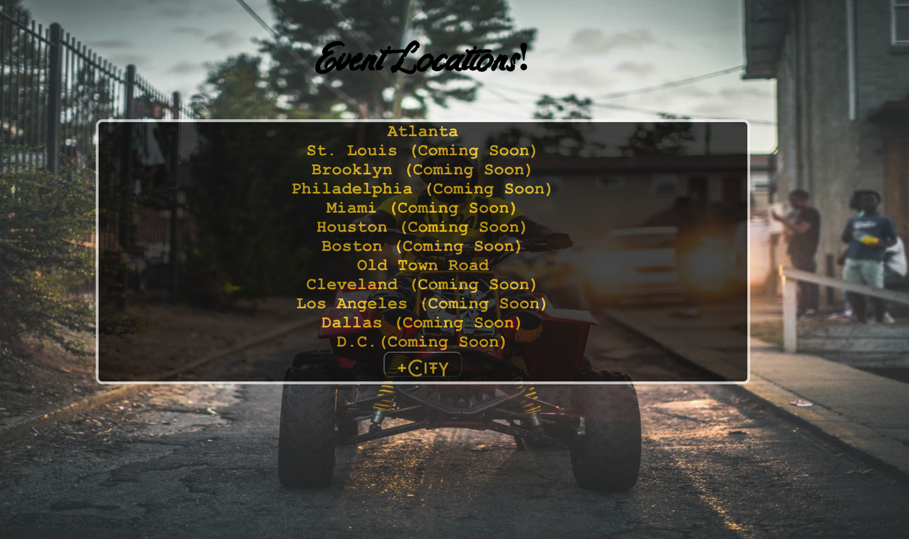
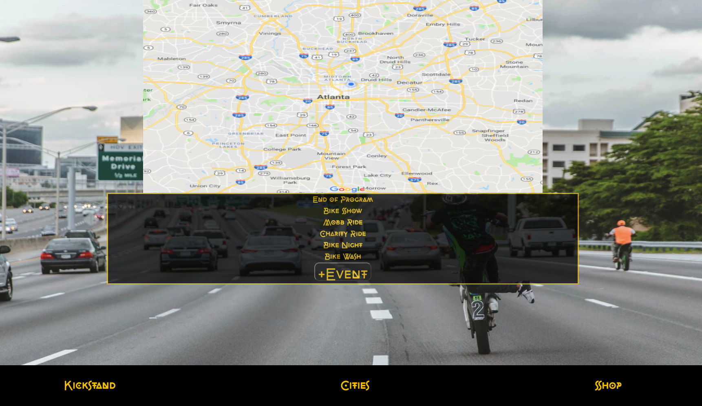

# The Kickstand App

#### A full crud web app designed to log motorcycle events in Atlnta.

## Description
The "Joos" podcast site is my first attempt to create a multi-page website. The hosts, segments, and content of this site are all original ideas. The goal was to show createive ways to display content while making a webpages that are interactive and engaging.

## Table of Contents
* [Technologies Used](#technologiesused)
* [Features](#features)
* [Design](#design)
* [Project Next Steps](#nextsteps)
* [Deployed App](#deployment)
* [About the Author](#author)

## Technologies Used
* JavaScript
* HTML5
* CSS3
* Axios
* Node.Js
* MongoDB
* React.js
* Express.js
* RESTful Routes

## Features
* Users can run full C.R.U.D. operation on 3 models
* App pulls live weather information from 3rd party API

## Whiteboard Images
* All Sketches are on notepad

## Trello Planning
* Link to Trello: https://trello.com/b/1GiDd5lD/project-4-kickstand-app

## Design
* Design elements implemented using React.js and CSS3

## Project Next Steps
* Users will be able to see current weather on all views
* Less distracting font
* Users will be able to comment on events
* Users will be able to login to view special events

## Deployed Link
* N/A

* You can view the repository:
[Github.com](https://github.com/Gr8ness21/thekickstandapp)
* If unable to view please go live locally through VS Code
    
## Works Cited:
* N/A

## About The Author
I build applications and mini projects tied to my various interests. I look for creative solutions to real world problems and think of technical ways to address them. While no application is ever perfect I find joy in the process and all my final products!

    
## Works Cited:
* N/A